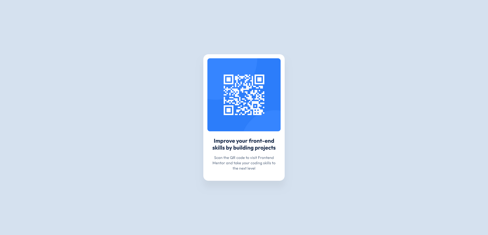

# Frontend Mentor - QR code component solution

This is a solution to the [QR code component challenge on Frontend Mentor](https://www.frontendmentor.io/challenges/qr-code-component-iux_sIO_H). Frontend Mentor challenges help you improve your coding skills by building realistic projects. 

## Table of contents
- [Overview](#overview)
  - [Screenshot](#screenshot)
  - [Links](#links)
- [Built with](#built-with)
- [Author](#author)

## Overview

### Screenshot

### Links
- Solution URL: [https://www.frontendmentor.io/solutions/qr-code-component-made-using-flexbox-iitj-UcSSr](https://www.frontendmentor.io/solutions/qr-code-component-made-using-flexbox-iitj-UcSSr)
- Live Site URL: [https://alexander3717.github.io/QRcodeChallenge/](https://alexander3717.github.io/QRcodeChallenge/)

## Built with
CSS Flexbox

## Author
Frontend Mentor - [@Alexander3717](https://www.frontendmentor.io/profile/Alexander3717)
